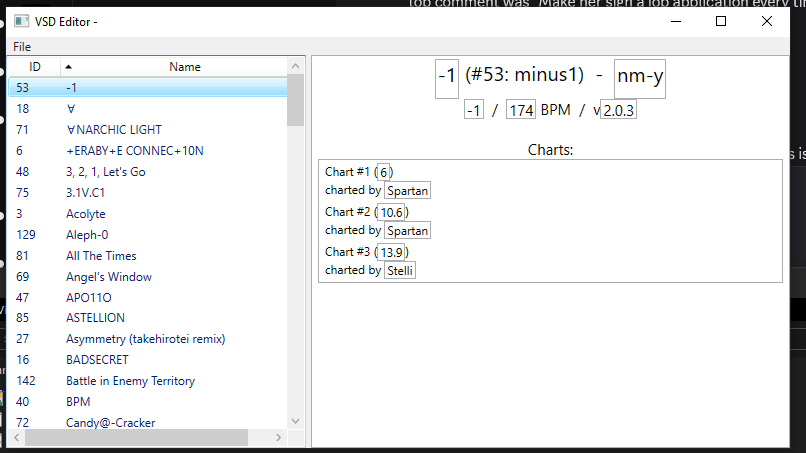
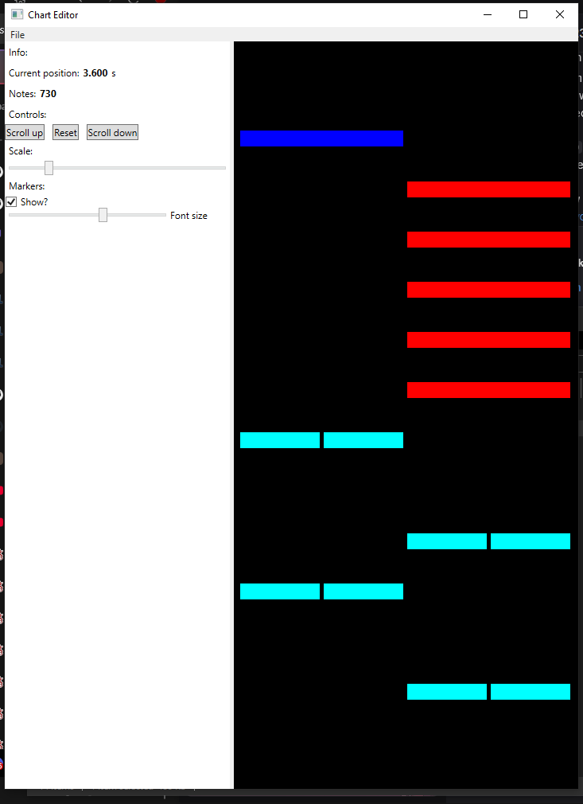

# VividTK
### Tools for working with vivid/stasis binary files

This project includes:

#### VSFormatLib
- A C# library to read/write vivid/stasis binary formats
- Supports VSD* (song_information.bin) files
- Supports VSB binary chart files

\* VSD here refers to the **binary** VSD format, not files with the .vsd extension. The former is only (currently) used for the song info file, while the latter are just text files containing various kinds of data.

#### DumpVSD/DumpChart
- Command line utilities to dump the eponymous binary files into JSON files
- Examples of the output of these tools are provided in the [`/SampleExport`](https://github.com/raineycat/VividTK/tree/main/SampleExport) directory in this repo
- These probably won't be useful for most users, but might be nice if you're doing something like parsing songs or charts with automated tools

#### VSDGUI
- A graphical editor for song information files, made using WPF and the afforementioned binary format library
- You can use this to change the name and metadata of charts in the game
- Song fields like name/formatted name/artist/BPM can be changed
- Per-chart fields like note designer/difficulty can also be changed
- You can also save your changes back to the file and see the names of songs change in-game :p

#### ChartEd
- A (currently) viewer, (eventually) editor for chart files, hacked together with WPF and Skia
- Currently supports **unified binary charts***, not text charts (yet)
- Most notes are currently handled and should display properly
- Meta-notes that represent BPM changes are also displayed as markers, however BPM isn't handled properly in the editor yet
- Modifiers/gimmicks are supported by the format library, however the editor can't display them yet, as they rely on knowing the BPM to display properly

\* unified charts are charts where both the note data and modifier/gimmick data are stored in the binary VSB file. Some newer charts store this in seperate text-based VMV files, which the format library can't handle (yet)

